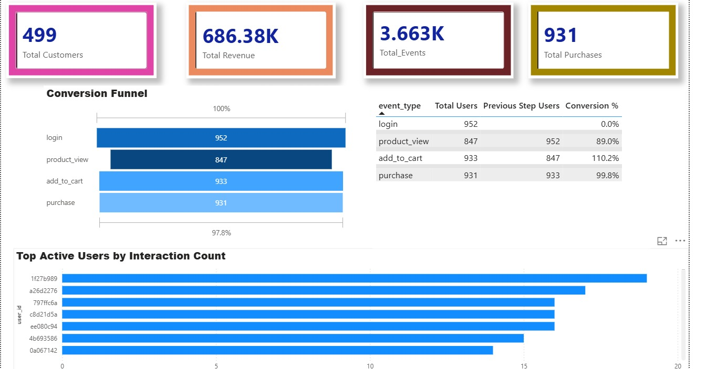

# 🚀 Customer 360 Real-Time Analytics & ML Platform (Enterprise Edition)

An end-to-end, enterprise-ready data engineering and analytics platform built to simulate, ingest, transform, and map real-time user eCommerce events into cohesive Customer 360 insights.

---

# 📸 Dashboard Preview



---

## 🏗️ Architecture Overview

The system is designed following modern Data Engineering principles, decoupling ingestion from analytical workloads using scalable Google Cloud components.

### Data Flow Architecture

`Pub/Sub (Stream)` → `Python Consumer (Micro-batch)` → `BigQuery (Data Warehouse)` → `dbt-style SQL` → `Airflow (Orchestration)` → `ML Models` → `Tableau & Flask (Dashboards)`

### Platform Workflow

1. **Ingestion & Streaming (`/ingestion`)**
   - Mock telemetry (`event_generator.py`) generates high-throughput JSON clickstream and transaction logs.
   - Events are published directly into **Google Cloud Pub/Sub**.

2. **Storage (`/storage`)**
   - The Cloud Consumer subscribes to the stream.
   - Uses micro-batching to load data efficiently into **Google BigQuery**.

3. **Transformation Layer (`/dbt_models`)**
   - SQL-based analytics engineering transformations inside BigQuery.
   - Includes:
     - Customer Lifetime Value (LTV)
     - Cohort Retention Analysis
     - Conversion Funnel Metrics
     - Revenue Aggregation Models

4. **Machine Learning (`/ml`)**
   - K-Means clustering for customer segmentation.
   - Churn prediction and activity-risk analysis pipelines.

5. **Orchestration (`/dags`)**
   - Apache Airflow automates:
     - SQL transformations
     - ML workflows
     - Data quality tasks
     - Scheduled pipelines

6. **Visualization**
   - Real-time dashboards powered by:
     - Flask
     - Tableau
     - BigQuery integrations

---

## 📊 Tableau Integration & Connection Guide

Connecting BigQuery to Tableau enables business analysts to build interactive enterprise dashboards.

### Setup Tableau Connection

1. Install the **Simba BigQuery ODBC Driver**
2. Open Tableau Desktop
3. Select:

```text
Connect to Data → Google BigQuery
```

4. Authenticate with your Google Cloud Account
5. Choose:
   - Billing Project: `customer-360-492614`
   - Dataset: `customer_360`

### Recommended Dashboards

#### Funnel Dashboard
- Rows → `stage`
- Columns → `total_events`

#### Revenue Trending
- Continuous hourly revenue visualization
- Aggregate using `SUM(total_revenue)`

#### Customer Segmentation
- Scatter Plot:
  - Frequency vs Monetary Value
  - Colored by `segment_label`

---

## 🛠️ Tech Stack & Coding Standards

### GCP Services
- Google Cloud Pub/Sub
- Google BigQuery
- IAM & Service Accounts

### Languages & Frameworks
- Python 3.11+
- Flask
- Standard SQL
- scikit-learn
- pandas-gbq

### Orchestration
- Apache Airflow 2.7+

### Coding Standards
- Centralized logging architecture
- Modular environment configurations
- Exception handling with retries
- Cloud/local deployment flexibility

---

## 📂 Enterprise Repository Structure

```text
├── config/                # Environment flags & constants
├── dags/                  # Apache Airflow DAG pipelines
├── dashboard/             # Flask application & templates
├── dbt_models/            # SQL transformation models
├── ingestion/             # Pub/Sub producers & consumers
├── ml/                    # ML segmentation & churn models
├── storage/               # SQLite fallback storage
├── transformations/       # DataFrame transformation scripts
├── utils/                 # Logging & helper utilities
├── public/                # Static assets and dashboard images
└── README.md              # Project documentation
```

---

## 🚀 Setup & Execution Instructions

### 1. Install Dependencies

```bash
pip install -r requirements.txt
```

### 2. Configure Google Cloud Credentials

```bash
$env:GOOGLE_APPLICATION_CREDENTIALS="C:\path\to\your-key.json"
```

Ensure the service account has:
- Pub/Sub Admin
- BigQuery Data Editor permissions

---

## 📡 Start Streaming Data

### Run Pub/Sub Publisher

```bash
python ingestion/gcp_publisher.py
```

### Run BigQuery Consumer

```bash
python ingestion/gcp_consumer.py
```

The consumer batches streaming events into BigQuery every 20 seconds.

---

## ⚙️ Execute Analytics & ML Pipelines

### Run LTV Analysis

```bash
python transformations/ltv_analysis.py
```

### Run Segmentation Model

```bash
python ml/segmentation.py
```

### Launch Dashboard

```bash
python dashboard/app.py
```

Open the dashboard in your browser:

```text
http://127.0.0.1:5000
```

---

## ✨ Key Features

- Real-time event ingestion
- BigQuery-native analytics
- Automated Airflow orchestration
- Customer segmentation using ML
- Conversion funnel tracking
- Revenue trend analysis
- Enterprise dashboard visualization
- Cloud-ready scalable architecture

---

## 📌 Future Enhancements

- Kafka integration
- CI/CD deployment pipelines
- Docker & Kubernetes deployment
- Real-time anomaly detection
- Advanced recommendation systems
- Multi-cloud support

---

## 👨‍💻 Author

Built for enterprise-grade Customer 360 analytics, scalable event processing, and real-time business intelligence workflows.
